# Dealing with Categorical Variables - Lab

## Introduction
In this lab, you'll explore the Boston Housing Data Set for categorical variables, and you'll transform your data so you'll be able to use categorical data as predictors!

## Objectives
You will be able to:
* Identify and inspect the categorical variables in the Boston housing data set
* Learn how to categorize inputs that aren't categorical
* Create new datasets with dummy variables 

## Importing the Boston Housing data set

Let's start by importing the Boston Housing data set. This data set is available in Scikit-Learn, and can be imported running the column below.


```python
import pandas as pd
from sklearn.datasets import load_boston
boston = load_boston()
```

If you'll inspect Boston now, you'll see that this basically returns a dictionary. Let's have a look at what exactly is stored in the dictionary by looking at the dictionary keys 


```python
# inspect boston
boston.keys()
```


    dict_keys(['data', 'target', 'feature_names', 'DESCR', 'filename'])


```python
# look at the keys
len(boston['data']), len(boston['target']), len(boston['feature_names']), len(boston['DESCR']), len(boston['filename'])
```


    (506, 506, 13, 2341, 99)


```python
boston.data
```


    array([[6.3200e-03, 1.8000e+01, 2.3100e+00, ..., 1.5300e+01, 3.9690e+02,
            4.9800e+00],
           [2.7310e-02, 0.0000e+00, 7.0700e+00, ..., 1.7800e+01, 3.9690e+02,
            9.1400e+00],
           [2.7290e-02, 0.0000e+00, 7.0700e+00, ..., 1.7800e+01, 3.9283e+02,
            4.0300e+00],
           ...,
           [6.0760e-02, 0.0000e+00, 1.1930e+01, ..., 2.1000e+01, 3.9690e+02,
            5.6400e+00],
           [1.0959e-01, 0.0000e+00, 1.1930e+01, ..., 2.1000e+01, 3.9345e+02,
            6.4800e+00],
           [4.7410e-02, 0.0000e+00, 1.1930e+01, ..., 2.1000e+01, 3.9690e+02,
            7.8800e+00]])


Let's create a Pandas DataFrame with the data (which are the features, not including the target) and the feature names as column names.


```python
boston_features = pd.DataFrame(boston.data, columns=boston.feature_names)
```


```python
#inspect the first few rows
boston_features.head()
```


<div>
<style scoped>
    .dataframe tbody tr th:only-of-type {
        vertical-align: middle;
    }

    .dataframe tbody tr th {
        vertical-align: top;
    }

    .dataframe thead th {
        text-align: right;
    }
</style>
<table border="1" class="dataframe">
  <thead>
    <tr style="text-align: right;">
      <th></th>
      <th>CRIM</th>
      <th>ZN</th>
      <th>INDUS</th>
      <th>CHAS</th>
      <th>NOX</th>
      <th>RM</th>
      <th>AGE</th>
      <th>DIS</th>
      <th>RAD</th>
      <th>TAX</th>
      <th>PTRATIO</th>
      <th>B</th>
      <th>LSTAT</th>
    </tr>
  </thead>
  <tbody>
    <tr>
      <th>0</th>
      <td>0.00632</td>
      <td>18.0</td>
      <td>2.31</td>
      <td>0.0</td>
      <td>0.538</td>
      <td>6.575</td>
      <td>65.2</td>
      <td>4.0900</td>
      <td>1.0</td>
      <td>296.0</td>
      <td>15.3</td>
      <td>396.90</td>
      <td>4.98</td>
    </tr>
    <tr>
      <th>1</th>
      <td>0.02731</td>
      <td>0.0</td>
      <td>7.07</td>
      <td>0.0</td>
      <td>0.469</td>
      <td>6.421</td>
      <td>78.9</td>
      <td>4.9671</td>
      <td>2.0</td>
      <td>242.0</td>
      <td>17.8</td>
      <td>396.90</td>
      <td>9.14</td>
    </tr>
    <tr>
      <th>2</th>
      <td>0.02729</td>
      <td>0.0</td>
      <td>7.07</td>
      <td>0.0</td>
      <td>0.469</td>
      <td>7.185</td>
      <td>61.1</td>
      <td>4.9671</td>
      <td>2.0</td>
      <td>242.0</td>
      <td>17.8</td>
      <td>392.83</td>
      <td>4.03</td>
    </tr>
    <tr>
      <th>3</th>
      <td>0.03237</td>
      <td>0.0</td>
      <td>2.18</td>
      <td>0.0</td>
      <td>0.458</td>
      <td>6.998</td>
      <td>45.8</td>
      <td>6.0622</td>
      <td>3.0</td>
      <td>222.0</td>
      <td>18.7</td>
      <td>394.63</td>
      <td>2.94</td>
    </tr>
    <tr>
      <th>4</th>
      <td>0.06905</td>
      <td>0.0</td>
      <td>2.18</td>
      <td>0.0</td>
      <td>0.458</td>
      <td>7.147</td>
      <td>54.2</td>
      <td>6.0622</td>
      <td>3.0</td>
      <td>222.0</td>
      <td>18.7</td>
      <td>396.90</td>
      <td>5.33</td>
    </tr>
  </tbody>
</table>
</div>


For your reference, we copied the attribute information below. Additional information can be found here: http://scikit-learn.org/stable/datasets/index.html#boston-dataset
- CRIM: per capita crime rate by town
- ZN: proportion of residential land zoned for lots over 25,000 sq.ft.
- INDUS: proportion of non-retail business acres per town
- CHAS: Charles River dummy variable (= 1 if tract bounds river; 0 otherwise)
- NOX: nitric oxides concentration (parts per 10 million)
- RM: average number of rooms per dwelling
- AGE: proportion of owner-occupied units built prior to 1940
- DIS: weighted distances to five Boston employment centres
- RAD: index of accessibility to radial highways
- TAX: full-value property-tax rate per $10,000
- PTRATIO: pupil-teacher ratio by town
- B: 1000(Bk - 0.63)^2 where Bk is the proportion of blacks by town
- LSTAT: % lower status of the population

Let's convert the target to a dataframe as well, and assign the column name "MEDV"


```python
boston_target = pd.DataFrame(boston.target, columns=['MEDV'])

#inspect the first few rows
boston_target.head()
```


<div>
<style scoped>
    .dataframe tbody tr th:only-of-type {
        vertical-align: middle;
    }

    .dataframe tbody tr th {
        vertical-align: top;
    }

    .dataframe thead th {
        text-align: right;
    }
</style>
<table border="1" class="dataframe">
  <thead>
    <tr style="text-align: right;">
      <th></th>
      <th>MEDV</th>
    </tr>
  </thead>
  <tbody>
    <tr>
      <th>0</th>
      <td>24.0</td>
    </tr>
    <tr>
      <th>1</th>
      <td>21.6</td>
    </tr>
    <tr>
      <th>2</th>
      <td>34.7</td>
    </tr>
    <tr>
      <th>3</th>
      <td>33.4</td>
    </tr>
    <tr>
      <th>4</th>
      <td>36.2</td>
    </tr>
  </tbody>
</table>
</div>


The target is described as: 
- MEDV: Median value of owner-occupied homes in $1000’s

Next, let's merge the target and the predictors in one dataframe `boston_df`.


```python
boston_df = pd.concat([boston_features, boston_target], sort=False, axis=1)
boston_df.head()
```


<div>
<style scoped>
    .dataframe tbody tr th:only-of-type {
        vertical-align: middle;
    }

    .dataframe tbody tr th {
        vertical-align: top;
    }

    .dataframe thead th {
        text-align: right;
    }
</style>
<table border="1" class="dataframe">
  <thead>
    <tr style="text-align: right;">
      <th></th>
      <th>CRIM</th>
      <th>ZN</th>
      <th>INDUS</th>
      <th>CHAS</th>
      <th>NOX</th>
      <th>RM</th>
      <th>AGE</th>
      <th>DIS</th>
      <th>RAD</th>
      <th>TAX</th>
      <th>PTRATIO</th>
      <th>B</th>
      <th>LSTAT</th>
      <th>MEDV</th>
    </tr>
  </thead>
  <tbody>
    <tr>
      <th>0</th>
      <td>0.00632</td>
      <td>18.0</td>
      <td>2.31</td>
      <td>0.0</td>
      <td>0.538</td>
      <td>6.575</td>
      <td>65.2</td>
      <td>4.0900</td>
      <td>1.0</td>
      <td>296.0</td>
      <td>15.3</td>
      <td>396.90</td>
      <td>4.98</td>
      <td>24.0</td>
    </tr>
    <tr>
      <th>1</th>
      <td>0.02731</td>
      <td>0.0</td>
      <td>7.07</td>
      <td>0.0</td>
      <td>0.469</td>
      <td>6.421</td>
      <td>78.9</td>
      <td>4.9671</td>
      <td>2.0</td>
      <td>242.0</td>
      <td>17.8</td>
      <td>396.90</td>
      <td>9.14</td>
      <td>21.6</td>
    </tr>
    <tr>
      <th>2</th>
      <td>0.02729</td>
      <td>0.0</td>
      <td>7.07</td>
      <td>0.0</td>
      <td>0.469</td>
      <td>7.185</td>
      <td>61.1</td>
      <td>4.9671</td>
      <td>2.0</td>
      <td>242.0</td>
      <td>17.8</td>
      <td>392.83</td>
      <td>4.03</td>
      <td>34.7</td>
    </tr>
    <tr>
      <th>3</th>
      <td>0.03237</td>
      <td>0.0</td>
      <td>2.18</td>
      <td>0.0</td>
      <td>0.458</td>
      <td>6.998</td>
      <td>45.8</td>
      <td>6.0622</td>
      <td>3.0</td>
      <td>222.0</td>
      <td>18.7</td>
      <td>394.63</td>
      <td>2.94</td>
      <td>33.4</td>
    </tr>
    <tr>
      <th>4</th>
      <td>0.06905</td>
      <td>0.0</td>
      <td>2.18</td>
      <td>0.0</td>
      <td>0.458</td>
      <td>7.147</td>
      <td>54.2</td>
      <td>6.0622</td>
      <td>3.0</td>
      <td>222.0</td>
      <td>18.7</td>
      <td>396.90</td>
      <td>5.33</td>
      <td>36.2</td>
    </tr>
  </tbody>
</table>
</div>


Let's inspect these 13 features using `.describe()` and `.info()`


```python
# code here
# code here
boston_df.describe()
```


<div>
<style scoped>
    .dataframe tbody tr th:only-of-type {
        vertical-align: middle;
    }

    .dataframe tbody tr th {
        vertical-align: top;
    }

    .dataframe thead th {
        text-align: right;
    }
</style>
<table border="1" class="dataframe">
  <thead>
    <tr style="text-align: right;">
      <th></th>
      <th>CRIM</th>
      <th>ZN</th>
      <th>INDUS</th>
      <th>CHAS</th>
      <th>NOX</th>
      <th>RM</th>
      <th>AGE</th>
      <th>DIS</th>
      <th>RAD</th>
      <th>TAX</th>
      <th>PTRATIO</th>
      <th>B</th>
      <th>LSTAT</th>
      <th>MEDV</th>
    </tr>
  </thead>
  <tbody>
    <tr>
      <th>count</th>
      <td>506.000000</td>
      <td>506.000000</td>
      <td>506.000000</td>
      <td>506.000000</td>
      <td>506.000000</td>
      <td>506.000000</td>
      <td>506.000000</td>
      <td>506.000000</td>
      <td>506.000000</td>
      <td>506.000000</td>
      <td>506.000000</td>
      <td>506.000000</td>
      <td>506.000000</td>
      <td>506.000000</td>
    </tr>
    <tr>
      <th>mean</th>
      <td>3.613524</td>
      <td>11.363636</td>
      <td>11.136779</td>
      <td>0.069170</td>
      <td>0.554695</td>
      <td>6.284634</td>
      <td>68.574901</td>
      <td>3.795043</td>
      <td>9.549407</td>
      <td>408.237154</td>
      <td>18.455534</td>
      <td>356.674032</td>
      <td>12.653063</td>
      <td>22.532806</td>
    </tr>
    <tr>
      <th>std</th>
      <td>8.601545</td>
      <td>23.322453</td>
      <td>6.860353</td>
      <td>0.253994</td>
      <td>0.115878</td>
      <td>0.702617</td>
      <td>28.148861</td>
      <td>2.105710</td>
      <td>8.707259</td>
      <td>168.537116</td>
      <td>2.164946</td>
      <td>91.294864</td>
      <td>7.141062</td>
      <td>9.197104</td>
    </tr>
    <tr>
      <th>min</th>
      <td>0.006320</td>
      <td>0.000000</td>
      <td>0.460000</td>
      <td>0.000000</td>
      <td>0.385000</td>
      <td>3.561000</td>
      <td>2.900000</td>
      <td>1.129600</td>
      <td>1.000000</td>
      <td>187.000000</td>
      <td>12.600000</td>
      <td>0.320000</td>
      <td>1.730000</td>
      <td>5.000000</td>
    </tr>
    <tr>
      <th>25%</th>
      <td>0.082045</td>
      <td>0.000000</td>
      <td>5.190000</td>
      <td>0.000000</td>
      <td>0.449000</td>
      <td>5.885500</td>
      <td>45.025000</td>
      <td>2.100175</td>
      <td>4.000000</td>
      <td>279.000000</td>
      <td>17.400000</td>
      <td>375.377500</td>
      <td>6.950000</td>
      <td>17.025000</td>
    </tr>
    <tr>
      <th>50%</th>
      <td>0.256510</td>
      <td>0.000000</td>
      <td>9.690000</td>
      <td>0.000000</td>
      <td>0.538000</td>
      <td>6.208500</td>
      <td>77.500000</td>
      <td>3.207450</td>
      <td>5.000000</td>
      <td>330.000000</td>
      <td>19.050000</td>
      <td>391.440000</td>
      <td>11.360000</td>
      <td>21.200000</td>
    </tr>
    <tr>
      <th>75%</th>
      <td>3.677083</td>
      <td>12.500000</td>
      <td>18.100000</td>
      <td>0.000000</td>
      <td>0.624000</td>
      <td>6.623500</td>
      <td>94.075000</td>
      <td>5.188425</td>
      <td>24.000000</td>
      <td>666.000000</td>
      <td>20.200000</td>
      <td>396.225000</td>
      <td>16.955000</td>
      <td>25.000000</td>
    </tr>
    <tr>
      <th>max</th>
      <td>88.976200</td>
      <td>100.000000</td>
      <td>27.740000</td>
      <td>1.000000</td>
      <td>0.871000</td>
      <td>8.780000</td>
      <td>100.000000</td>
      <td>12.126500</td>
      <td>24.000000</td>
      <td>711.000000</td>
      <td>22.000000</td>
      <td>396.900000</td>
      <td>37.970000</td>
      <td>50.000000</td>
    </tr>
  </tbody>
</table>
</div>


```python
boston_df.info()
```

    <class 'pandas.core.frame.DataFrame'>
    RangeIndex: 506 entries, 0 to 505
    Data columns (total 14 columns):
    CRIM       506 non-null float64
    ZN         506 non-null float64
    INDUS      506 non-null float64
    CHAS       506 non-null float64
    NOX        506 non-null float64
    RM         506 non-null float64
    AGE        506 non-null float64
    DIS        506 non-null float64
    RAD        506 non-null float64
    TAX        506 non-null float64
    PTRATIO    506 non-null float64
    B          506 non-null float64
    LSTAT      506 non-null float64
    MEDV       506 non-null float64
    dtypes: float64(14)
    memory usage: 55.4 KB


Now, take a look at the scatter plots for each predictor with the target on the y-axis.


```python
import pandas as pd
import matplotlib.pyplot as plt

# create scatter plots
for var in boston_features.columns:
    boston_df.plot.scatter(x=var, y='MEDV');
```


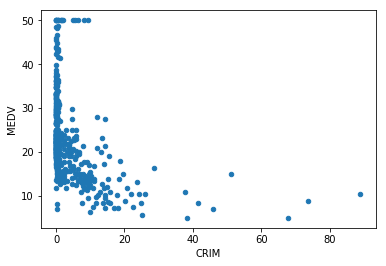


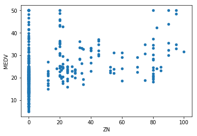


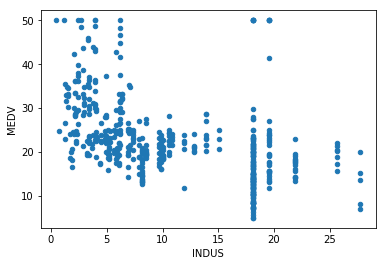


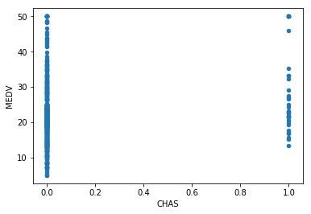


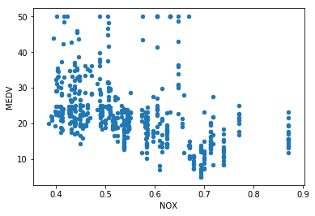


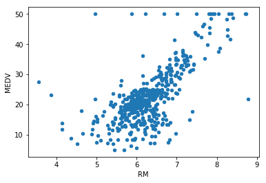


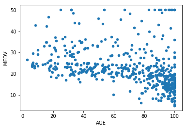


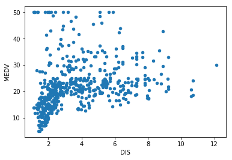


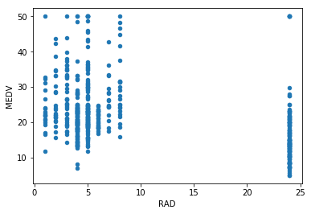


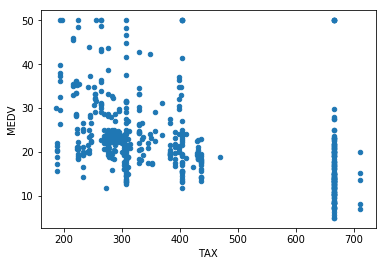


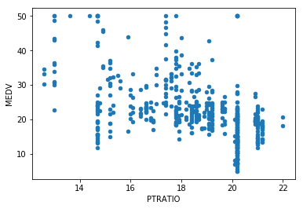


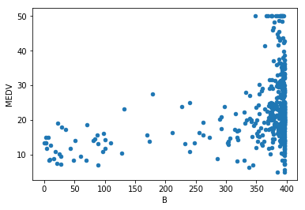


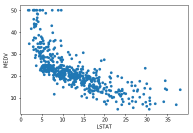


## To categorical: binning

If you created your scatterplots correctly, you'll notice that except for CHAS (the Charles River Dummy variable), there is no clearly categorical data. You will have seen though that RAD and TAX have more of a vertical-looking structure like the one seen in the lesson, and that there is less of a "cloud"-looking structure compared to most other variables. It is difficult to justify a linear pattern between predictor and target here. In this situation, it might make sense to restructure data into bins so that they're treated as categorical variables. We'll start by showing how this can be done for RAD and then it's your turn to do this for TAX.

### "RAD"

Look at the structure of "RAD" to decide how to create your bins. 


```python
boston_df["RAD"].describe()
```


    count    506.000000
    mean       9.549407
    std        8.707259
    min        1.000000
    25%        4.000000
    50%        5.000000
    75%       24.000000
    max       24.000000
    Name: RAD, dtype: float64


```python
# first, create bins for based on the values observed. 5 values will result in 4 bins
bins = [0, 3, 4 , 5, 24]
# use pd.cut
bins_rad = pd.cut(boston_df['RAD'], bins)
```


```python
# using pd.cut returns unordered categories. Transform this to ordered categories.
bins_rad = bins_rad.cat.as_unordered()
bins_rad.head()
```


    0    (0, 3]
    1    (0, 3]
    2    (0, 3]
    3    (0, 3]
    4    (0, 3]
    Name: RAD, dtype: category
    Categories (4, interval[int64]): [(0, 3], (3, 4], (4, 5], (5, 24]]


```python
# inspect the result
bins_rad.value_counts().plot(kind='bar')
```


    <matplotlib.axes._subplots.AxesSubplot at 0x7fd671fc65c0>


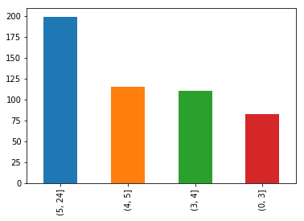


```python
# replace the existing "RAD" column
boston_df["RAD"]=bins_rad.cat.codes.astype('category')
```

### "TAX"

Split the "TAX" column up in 5 categories. You can chose the bins as desired but make sure they're pretty well-balanced.


```python
# repeat everything for "TAX"
boston_df['TAX'].describe()
```


    count    506.000000
    mean     408.237154
    std      168.537116
    min      187.000000
    25%      279.000000
    50%      330.000000
    75%      666.000000
    max      711.000000
    Name: TAX, dtype: float64


```python
bins = [186, 278, 279, 330, 666, 711]
bins_tax = pd.cut(boston_df['TAX'], bins)
bins_tax = bins_tax.cat.as_unordered()
bins_tax.head()
```


    0    (279, 330]
    1    (186, 278]
    2    (186, 278]
    3    (186, 278]
    4    (186, 278]
    Name: TAX, dtype: category
    Categories (5, interval[int64]): [(186, 278], (278, 279], (279, 330], (330, 666], (666, 711]]


```python
bins_tax.value_counts().plot(kind='bar')
```


    <matplotlib.axes._subplots.AxesSubplot at 0x7fd6a0361780>


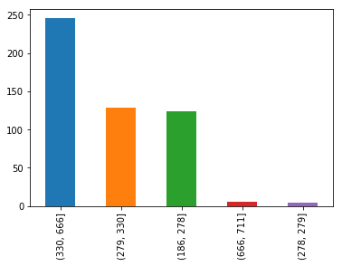


```python
boston_df['TAX'] = bins_tax
boston_df['TAX']
```


    0      (279, 330]
    1      (186, 278]
    2      (186, 278]
    3      (186, 278]
    4      (186, 278]
    5      (186, 278]
    6      (279, 330]
    7      (279, 330]
    8      (279, 330]
    9      (279, 330]
    10     (279, 330]
    11     (279, 330]
    12     (279, 330]
    13     (279, 330]
    14     (279, 330]
    15     (279, 330]
    16     (279, 330]
    17     (279, 330]
    18     (279, 330]
    19     (279, 330]
    20     (279, 330]
    21     (279, 330]
    22     (279, 330]
    23     (279, 330]
    24     (279, 330]
    25     (279, 330]
    26     (279, 330]
    27     (279, 330]
    28     (279, 330]
    29     (279, 330]
              ...    
    476    (330, 666]
    477    (330, 666]
    478    (330, 666]
    479    (330, 666]
    480    (330, 666]
    481    (330, 666]
    482    (330, 666]
    483    (330, 666]
    484    (330, 666]
    485    (330, 666]
    486    (330, 666]
    487    (330, 666]
    488    (666, 711]
    489    (666, 711]
    490    (666, 711]
    491    (666, 711]
    492    (666, 711]
    493    (330, 666]
    494    (330, 666]
    495    (330, 666]
    496    (330, 666]
    497    (330, 666]
    498    (330, 666]
    499    (330, 666]
    500    (330, 666]
    501    (186, 278]
    502    (186, 278]
    503    (186, 278]
    504    (186, 278]
    505    (186, 278]
    Name: TAX, Length: 506, dtype: category
    Categories (5, interval[int64]): [(186, 278], (278, 279], (279, 330], (330, 666], (666, 711]]


## Perform label encoding 


```python
# perform label encoding and replace in boston_df
boston_df['CHAS'] = boston_df['CHAS'].astype('category').cat.codes.astype('category')
boston_df['TAX'] = boston_df['TAX'].astype('category').cat.codes.astype('category')
boston_df.info()
```

    <class 'pandas.core.frame.DataFrame'>
    RangeIndex: 506 entries, 0 to 505
    Data columns (total 14 columns):
    CRIM       506 non-null float64
    ZN         506 non-null float64
    INDUS      506 non-null float64
    CHAS       506 non-null category
    NOX        506 non-null float64
    RM         506 non-null float64
    AGE        506 non-null float64
    DIS        506 non-null float64
    RAD        506 non-null category
    TAX        506 non-null category
    PTRATIO    506 non-null float64
    B          506 non-null float64
    LSTAT      506 non-null float64
    MEDV       506 non-null float64
    dtypes: category(3), float64(11)
    memory usage: 45.5 KB


```python
# inspect first few columns
boston_df.head()
```


<div>
<style scoped>
    .dataframe tbody tr th:only-of-type {
        vertical-align: middle;
    }

    .dataframe tbody tr th {
        vertical-align: top;
    }

    .dataframe thead th {
        text-align: right;
    }
</style>
<table border="1" class="dataframe">
  <thead>
    <tr style="text-align: right;">
      <th></th>
      <th>CRIM</th>
      <th>ZN</th>
      <th>INDUS</th>
      <th>CHAS</th>
      <th>NOX</th>
      <th>RM</th>
      <th>AGE</th>
      <th>DIS</th>
      <th>RAD</th>
      <th>TAX</th>
      <th>PTRATIO</th>
      <th>B</th>
      <th>LSTAT</th>
      <th>MEDV</th>
    </tr>
  </thead>
  <tbody>
    <tr>
      <th>0</th>
      <td>0.00632</td>
      <td>18.0</td>
      <td>2.31</td>
      <td>0</td>
      <td>0.538</td>
      <td>6.575</td>
      <td>65.2</td>
      <td>4.0900</td>
      <td>0</td>
      <td>2</td>
      <td>15.3</td>
      <td>396.90</td>
      <td>4.98</td>
      <td>24.0</td>
    </tr>
    <tr>
      <th>1</th>
      <td>0.02731</td>
      <td>0.0</td>
      <td>7.07</td>
      <td>0</td>
      <td>0.469</td>
      <td>6.421</td>
      <td>78.9</td>
      <td>4.9671</td>
      <td>0</td>
      <td>0</td>
      <td>17.8</td>
      <td>396.90</td>
      <td>9.14</td>
      <td>21.6</td>
    </tr>
    <tr>
      <th>2</th>
      <td>0.02729</td>
      <td>0.0</td>
      <td>7.07</td>
      <td>0</td>
      <td>0.469</td>
      <td>7.185</td>
      <td>61.1</td>
      <td>4.9671</td>
      <td>0</td>
      <td>0</td>
      <td>17.8</td>
      <td>392.83</td>
      <td>4.03</td>
      <td>34.7</td>
    </tr>
    <tr>
      <th>3</th>
      <td>0.03237</td>
      <td>0.0</td>
      <td>2.18</td>
      <td>0</td>
      <td>0.458</td>
      <td>6.998</td>
      <td>45.8</td>
      <td>6.0622</td>
      <td>0</td>
      <td>0</td>
      <td>18.7</td>
      <td>394.63</td>
      <td>2.94</td>
      <td>33.4</td>
    </tr>
    <tr>
      <th>4</th>
      <td>0.06905</td>
      <td>0.0</td>
      <td>2.18</td>
      <td>0</td>
      <td>0.458</td>
      <td>7.147</td>
      <td>54.2</td>
      <td>6.0622</td>
      <td>0</td>
      <td>0</td>
      <td>18.7</td>
      <td>396.90</td>
      <td>5.33</td>
      <td>36.2</td>
    </tr>
  </tbody>
</table>
</div>


## Create dummy variables

Create dummy variables, and make sure their column names contain "TAX" and "RAD". Add the new dummy variables to boston_df and remove the old "RAD" and "TAX" columns.


```python
# code goes here
pd.get_dummies(boston_df, columns=['RAD', 'TAX'], prefix = ['RAD', 'TAX'])
```


<div>
<style scoped>
    .dataframe tbody tr th:only-of-type {
        vertical-align: middle;
    }

    .dataframe tbody tr th {
        vertical-align: top;
    }

    .dataframe thead th {
        text-align: right;
    }
</style>
<table border="1" class="dataframe">
  <thead>
    <tr style="text-align: right;">
      <th></th>
      <th>CRIM</th>
      <th>ZN</th>
      <th>INDUS</th>
      <th>CHAS</th>
      <th>NOX</th>
      <th>RM</th>
      <th>AGE</th>
      <th>DIS</th>
      <th>PTRATIO</th>
      <th>B</th>
      <th>...</th>
      <th>MEDV</th>
      <th>RAD_0</th>
      <th>RAD_1</th>
      <th>RAD_2</th>
      <th>RAD_3</th>
      <th>TAX_0</th>
      <th>TAX_1</th>
      <th>TAX_2</th>
      <th>TAX_3</th>
      <th>TAX_4</th>
    </tr>
  </thead>
  <tbody>
    <tr>
      <th>0</th>
      <td>0.00632</td>
      <td>18.0</td>
      <td>2.31</td>
      <td>0</td>
      <td>0.538</td>
      <td>6.575</td>
      <td>65.2</td>
      <td>4.0900</td>
      <td>15.3</td>
      <td>396.90</td>
      <td>...</td>
      <td>24.0</td>
      <td>1</td>
      <td>0</td>
      <td>0</td>
      <td>0</td>
      <td>0</td>
      <td>0</td>
      <td>1</td>
      <td>0</td>
      <td>0</td>
    </tr>
    <tr>
      <th>1</th>
      <td>0.02731</td>
      <td>0.0</td>
      <td>7.07</td>
      <td>0</td>
      <td>0.469</td>
      <td>6.421</td>
      <td>78.9</td>
      <td>4.9671</td>
      <td>17.8</td>
      <td>396.90</td>
      <td>...</td>
      <td>21.6</td>
      <td>1</td>
      <td>0</td>
      <td>0</td>
      <td>0</td>
      <td>1</td>
      <td>0</td>
      <td>0</td>
      <td>0</td>
      <td>0</td>
    </tr>
    <tr>
      <th>2</th>
      <td>0.02729</td>
      <td>0.0</td>
      <td>7.07</td>
      <td>0</td>
      <td>0.469</td>
      <td>7.185</td>
      <td>61.1</td>
      <td>4.9671</td>
      <td>17.8</td>
      <td>392.83</td>
      <td>...</td>
      <td>34.7</td>
      <td>1</td>
      <td>0</td>
      <td>0</td>
      <td>0</td>
      <td>1</td>
      <td>0</td>
      <td>0</td>
      <td>0</td>
      <td>0</td>
    </tr>
    <tr>
      <th>3</th>
      <td>0.03237</td>
      <td>0.0</td>
      <td>2.18</td>
      <td>0</td>
      <td>0.458</td>
      <td>6.998</td>
      <td>45.8</td>
      <td>6.0622</td>
      <td>18.7</td>
      <td>394.63</td>
      <td>...</td>
      <td>33.4</td>
      <td>1</td>
      <td>0</td>
      <td>0</td>
      <td>0</td>
      <td>1</td>
      <td>0</td>
      <td>0</td>
      <td>0</td>
      <td>0</td>
    </tr>
    <tr>
      <th>4</th>
      <td>0.06905</td>
      <td>0.0</td>
      <td>2.18</td>
      <td>0</td>
      <td>0.458</td>
      <td>7.147</td>
      <td>54.2</td>
      <td>6.0622</td>
      <td>18.7</td>
      <td>396.90</td>
      <td>...</td>
      <td>36.2</td>
      <td>1</td>
      <td>0</td>
      <td>0</td>
      <td>0</td>
      <td>1</td>
      <td>0</td>
      <td>0</td>
      <td>0</td>
      <td>0</td>
    </tr>
    <tr>
      <th>5</th>
      <td>0.02985</td>
      <td>0.0</td>
      <td>2.18</td>
      <td>0</td>
      <td>0.458</td>
      <td>6.430</td>
      <td>58.7</td>
      <td>6.0622</td>
      <td>18.7</td>
      <td>394.12</td>
      <td>...</td>
      <td>28.7</td>
      <td>1</td>
      <td>0</td>
      <td>0</td>
      <td>0</td>
      <td>1</td>
      <td>0</td>
      <td>0</td>
      <td>0</td>
      <td>0</td>
    </tr>
    <tr>
      <th>6</th>
      <td>0.08829</td>
      <td>12.5</td>
      <td>7.87</td>
      <td>0</td>
      <td>0.524</td>
      <td>6.012</td>
      <td>66.6</td>
      <td>5.5605</td>
      <td>15.2</td>
      <td>395.60</td>
      <td>...</td>
      <td>22.9</td>
      <td>0</td>
      <td>0</td>
      <td>1</td>
      <td>0</td>
      <td>0</td>
      <td>0</td>
      <td>1</td>
      <td>0</td>
      <td>0</td>
    </tr>
    <tr>
      <th>7</th>
      <td>0.14455</td>
      <td>12.5</td>
      <td>7.87</td>
      <td>0</td>
      <td>0.524</td>
      <td>6.172</td>
      <td>96.1</td>
      <td>5.9505</td>
      <td>15.2</td>
      <td>396.90</td>
      <td>...</td>
      <td>27.1</td>
      <td>0</td>
      <td>0</td>
      <td>1</td>
      <td>0</td>
      <td>0</td>
      <td>0</td>
      <td>1</td>
      <td>0</td>
      <td>0</td>
    </tr>
    <tr>
      <th>8</th>
      <td>0.21124</td>
      <td>12.5</td>
      <td>7.87</td>
      <td>0</td>
      <td>0.524</td>
      <td>5.631</td>
      <td>100.0</td>
      <td>6.0821</td>
      <td>15.2</td>
      <td>386.63</td>
      <td>...</td>
      <td>16.5</td>
      <td>0</td>
      <td>0</td>
      <td>1</td>
      <td>0</td>
      <td>0</td>
      <td>0</td>
      <td>1</td>
      <td>0</td>
      <td>0</td>
    </tr>
    <tr>
      <th>9</th>
      <td>0.17004</td>
      <td>12.5</td>
      <td>7.87</td>
      <td>0</td>
      <td>0.524</td>
      <td>6.004</td>
      <td>85.9</td>
      <td>6.5921</td>
      <td>15.2</td>
      <td>386.71</td>
      <td>...</td>
      <td>18.9</td>
      <td>0</td>
      <td>0</td>
      <td>1</td>
      <td>0</td>
      <td>0</td>
      <td>0</td>
      <td>1</td>
      <td>0</td>
      <td>0</td>
    </tr>
    <tr>
      <th>10</th>
      <td>0.22489</td>
      <td>12.5</td>
      <td>7.87</td>
      <td>0</td>
      <td>0.524</td>
      <td>6.377</td>
      <td>94.3</td>
      <td>6.3467</td>
      <td>15.2</td>
      <td>392.52</td>
      <td>...</td>
      <td>15.0</td>
      <td>0</td>
      <td>0</td>
      <td>1</td>
      <td>0</td>
      <td>0</td>
      <td>0</td>
      <td>1</td>
      <td>0</td>
      <td>0</td>
    </tr>
    <tr>
      <th>11</th>
      <td>0.11747</td>
      <td>12.5</td>
      <td>7.87</td>
      <td>0</td>
      <td>0.524</td>
      <td>6.009</td>
      <td>82.9</td>
      <td>6.2267</td>
      <td>15.2</td>
      <td>396.90</td>
      <td>...</td>
      <td>18.9</td>
      <td>0</td>
      <td>0</td>
      <td>1</td>
      <td>0</td>
      <td>0</td>
      <td>0</td>
      <td>1</td>
      <td>0</td>
      <td>0</td>
    </tr>
    <tr>
      <th>12</th>
      <td>0.09378</td>
      <td>12.5</td>
      <td>7.87</td>
      <td>0</td>
      <td>0.524</td>
      <td>5.889</td>
      <td>39.0</td>
      <td>5.4509</td>
      <td>15.2</td>
      <td>390.50</td>
      <td>...</td>
      <td>21.7</td>
      <td>0</td>
      <td>0</td>
      <td>1</td>
      <td>0</td>
      <td>0</td>
      <td>0</td>
      <td>1</td>
      <td>0</td>
      <td>0</td>
    </tr>
    <tr>
      <th>13</th>
      <td>0.62976</td>
      <td>0.0</td>
      <td>8.14</td>
      <td>0</td>
      <td>0.538</td>
      <td>5.949</td>
      <td>61.8</td>
      <td>4.7075</td>
      <td>21.0</td>
      <td>396.90</td>
      <td>...</td>
      <td>20.4</td>
      <td>0</td>
      <td>1</td>
      <td>0</td>
      <td>0</td>
      <td>0</td>
      <td>0</td>
      <td>1</td>
      <td>0</td>
      <td>0</td>
    </tr>
    <tr>
      <th>14</th>
      <td>0.63796</td>
      <td>0.0</td>
      <td>8.14</td>
      <td>0</td>
      <td>0.538</td>
      <td>6.096</td>
      <td>84.5</td>
      <td>4.4619</td>
      <td>21.0</td>
      <td>380.02</td>
      <td>...</td>
      <td>18.2</td>
      <td>0</td>
      <td>1</td>
      <td>0</td>
      <td>0</td>
      <td>0</td>
      <td>0</td>
      <td>1</td>
      <td>0</td>
      <td>0</td>
    </tr>
    <tr>
      <th>15</th>
      <td>0.62739</td>
      <td>0.0</td>
      <td>8.14</td>
      <td>0</td>
      <td>0.538</td>
      <td>5.834</td>
      <td>56.5</td>
      <td>4.4986</td>
      <td>21.0</td>
      <td>395.62</td>
      <td>...</td>
      <td>19.9</td>
      <td>0</td>
      <td>1</td>
      <td>0</td>
      <td>0</td>
      <td>0</td>
      <td>0</td>
      <td>1</td>
      <td>0</td>
      <td>0</td>
    </tr>
    <tr>
      <th>16</th>
      <td>1.05393</td>
      <td>0.0</td>
      <td>8.14</td>
      <td>0</td>
      <td>0.538</td>
      <td>5.935</td>
      <td>29.3</td>
      <td>4.4986</td>
      <td>21.0</td>
      <td>386.85</td>
      <td>...</td>
      <td>23.1</td>
      <td>0</td>
      <td>1</td>
      <td>0</td>
      <td>0</td>
      <td>0</td>
      <td>0</td>
      <td>1</td>
      <td>0</td>
      <td>0</td>
    </tr>
    <tr>
      <th>17</th>
      <td>0.78420</td>
      <td>0.0</td>
      <td>8.14</td>
      <td>0</td>
      <td>0.538</td>
      <td>5.990</td>
      <td>81.7</td>
      <td>4.2579</td>
      <td>21.0</td>
      <td>386.75</td>
      <td>...</td>
      <td>17.5</td>
      <td>0</td>
      <td>1</td>
      <td>0</td>
      <td>0</td>
      <td>0</td>
      <td>0</td>
      <td>1</td>
      <td>0</td>
      <td>0</td>
    </tr>
    <tr>
      <th>18</th>
      <td>0.80271</td>
      <td>0.0</td>
      <td>8.14</td>
      <td>0</td>
      <td>0.538</td>
      <td>5.456</td>
      <td>36.6</td>
      <td>3.7965</td>
      <td>21.0</td>
      <td>288.99</td>
      <td>...</td>
      <td>20.2</td>
      <td>0</td>
      <td>1</td>
      <td>0</td>
      <td>0</td>
      <td>0</td>
      <td>0</td>
      <td>1</td>
      <td>0</td>
      <td>0</td>
    </tr>
    <tr>
      <th>19</th>
      <td>0.72580</td>
      <td>0.0</td>
      <td>8.14</td>
      <td>0</td>
      <td>0.538</td>
      <td>5.727</td>
      <td>69.5</td>
      <td>3.7965</td>
      <td>21.0</td>
      <td>390.95</td>
      <td>...</td>
      <td>18.2</td>
      <td>0</td>
      <td>1</td>
      <td>0</td>
      <td>0</td>
      <td>0</td>
      <td>0</td>
      <td>1</td>
      <td>0</td>
      <td>0</td>
    </tr>
    <tr>
      <th>20</th>
      <td>1.25179</td>
      <td>0.0</td>
      <td>8.14</td>
      <td>0</td>
      <td>0.538</td>
      <td>5.570</td>
      <td>98.1</td>
      <td>3.7979</td>
      <td>21.0</td>
      <td>376.57</td>
      <td>...</td>
      <td>13.6</td>
      <td>0</td>
      <td>1</td>
      <td>0</td>
      <td>0</td>
      <td>0</td>
      <td>0</td>
      <td>1</td>
      <td>0</td>
      <td>0</td>
    </tr>
    <tr>
      <th>21</th>
      <td>0.85204</td>
      <td>0.0</td>
      <td>8.14</td>
      <td>0</td>
      <td>0.538</td>
      <td>5.965</td>
      <td>89.2</td>
      <td>4.0123</td>
      <td>21.0</td>
      <td>392.53</td>
      <td>...</td>
      <td>19.6</td>
      <td>0</td>
      <td>1</td>
      <td>0</td>
      <td>0</td>
      <td>0</td>
      <td>0</td>
      <td>1</td>
      <td>0</td>
      <td>0</td>
    </tr>
    <tr>
      <th>22</th>
      <td>1.23247</td>
      <td>0.0</td>
      <td>8.14</td>
      <td>0</td>
      <td>0.538</td>
      <td>6.142</td>
      <td>91.7</td>
      <td>3.9769</td>
      <td>21.0</td>
      <td>396.90</td>
      <td>...</td>
      <td>15.2</td>
      <td>0</td>
      <td>1</td>
      <td>0</td>
      <td>0</td>
      <td>0</td>
      <td>0</td>
      <td>1</td>
      <td>0</td>
      <td>0</td>
    </tr>
    <tr>
      <th>23</th>
      <td>0.98843</td>
      <td>0.0</td>
      <td>8.14</td>
      <td>0</td>
      <td>0.538</td>
      <td>5.813</td>
      <td>100.0</td>
      <td>4.0952</td>
      <td>21.0</td>
      <td>394.54</td>
      <td>...</td>
      <td>14.5</td>
      <td>0</td>
      <td>1</td>
      <td>0</td>
      <td>0</td>
      <td>0</td>
      <td>0</td>
      <td>1</td>
      <td>0</td>
      <td>0</td>
    </tr>
    <tr>
      <th>24</th>
      <td>0.75026</td>
      <td>0.0</td>
      <td>8.14</td>
      <td>0</td>
      <td>0.538</td>
      <td>5.924</td>
      <td>94.1</td>
      <td>4.3996</td>
      <td>21.0</td>
      <td>394.33</td>
      <td>...</td>
      <td>15.6</td>
      <td>0</td>
      <td>1</td>
      <td>0</td>
      <td>0</td>
      <td>0</td>
      <td>0</td>
      <td>1</td>
      <td>0</td>
      <td>0</td>
    </tr>
    <tr>
      <th>25</th>
      <td>0.84054</td>
      <td>0.0</td>
      <td>8.14</td>
      <td>0</td>
      <td>0.538</td>
      <td>5.599</td>
      <td>85.7</td>
      <td>4.4546</td>
      <td>21.0</td>
      <td>303.42</td>
      <td>...</td>
      <td>13.9</td>
      <td>0</td>
      <td>1</td>
      <td>0</td>
      <td>0</td>
      <td>0</td>
      <td>0</td>
      <td>1</td>
      <td>0</td>
      <td>0</td>
    </tr>
    <tr>
      <th>26</th>
      <td>0.67191</td>
      <td>0.0</td>
      <td>8.14</td>
      <td>0</td>
      <td>0.538</td>
      <td>5.813</td>
      <td>90.3</td>
      <td>4.6820</td>
      <td>21.0</td>
      <td>376.88</td>
      <td>...</td>
      <td>16.6</td>
      <td>0</td>
      <td>1</td>
      <td>0</td>
      <td>0</td>
      <td>0</td>
      <td>0</td>
      <td>1</td>
      <td>0</td>
      <td>0</td>
    </tr>
    <tr>
      <th>27</th>
      <td>0.95577</td>
      <td>0.0</td>
      <td>8.14</td>
      <td>0</td>
      <td>0.538</td>
      <td>6.047</td>
      <td>88.8</td>
      <td>4.4534</td>
      <td>21.0</td>
      <td>306.38</td>
      <td>...</td>
      <td>14.8</td>
      <td>0</td>
      <td>1</td>
      <td>0</td>
      <td>0</td>
      <td>0</td>
      <td>0</td>
      <td>1</td>
      <td>0</td>
      <td>0</td>
    </tr>
    <tr>
      <th>28</th>
      <td>0.77299</td>
      <td>0.0</td>
      <td>8.14</td>
      <td>0</td>
      <td>0.538</td>
      <td>6.495</td>
      <td>94.4</td>
      <td>4.4547</td>
      <td>21.0</td>
      <td>387.94</td>
      <td>...</td>
      <td>18.4</td>
      <td>0</td>
      <td>1</td>
      <td>0</td>
      <td>0</td>
      <td>0</td>
      <td>0</td>
      <td>1</td>
      <td>0</td>
      <td>0</td>
    </tr>
    <tr>
      <th>29</th>
      <td>1.00245</td>
      <td>0.0</td>
      <td>8.14</td>
      <td>0</td>
      <td>0.538</td>
      <td>6.674</td>
      <td>87.3</td>
      <td>4.2390</td>
      <td>21.0</td>
      <td>380.23</td>
      <td>...</td>
      <td>21.0</td>
      <td>0</td>
      <td>1</td>
      <td>0</td>
      <td>0</td>
      <td>0</td>
      <td>0</td>
      <td>1</td>
      <td>0</td>
      <td>0</td>
    </tr>
    <tr>
      <th>...</th>
      <td>...</td>
      <td>...</td>
      <td>...</td>
      <td>...</td>
      <td>...</td>
      <td>...</td>
      <td>...</td>
      <td>...</td>
      <td>...</td>
      <td>...</td>
      <td>...</td>
      <td>...</td>
      <td>...</td>
      <td>...</td>
      <td>...</td>
      <td>...</td>
      <td>...</td>
      <td>...</td>
      <td>...</td>
      <td>...</td>
      <td>...</td>
    </tr>
    <tr>
      <th>476</th>
      <td>4.87141</td>
      <td>0.0</td>
      <td>18.10</td>
      <td>0</td>
      <td>0.614</td>
      <td>6.484</td>
      <td>93.6</td>
      <td>2.3053</td>
      <td>20.2</td>
      <td>396.21</td>
      <td>...</td>
      <td>16.7</td>
      <td>0</td>
      <td>0</td>
      <td>0</td>
      <td>1</td>
      <td>0</td>
      <td>0</td>
      <td>0</td>
      <td>1</td>
      <td>0</td>
    </tr>
    <tr>
      <th>477</th>
      <td>15.02340</td>
      <td>0.0</td>
      <td>18.10</td>
      <td>0</td>
      <td>0.614</td>
      <td>5.304</td>
      <td>97.3</td>
      <td>2.1007</td>
      <td>20.2</td>
      <td>349.48</td>
      <td>...</td>
      <td>12.0</td>
      <td>0</td>
      <td>0</td>
      <td>0</td>
      <td>1</td>
      <td>0</td>
      <td>0</td>
      <td>0</td>
      <td>1</td>
      <td>0</td>
    </tr>
    <tr>
      <th>478</th>
      <td>10.23300</td>
      <td>0.0</td>
      <td>18.10</td>
      <td>0</td>
      <td>0.614</td>
      <td>6.185</td>
      <td>96.7</td>
      <td>2.1705</td>
      <td>20.2</td>
      <td>379.70</td>
      <td>...</td>
      <td>14.6</td>
      <td>0</td>
      <td>0</td>
      <td>0</td>
      <td>1</td>
      <td>0</td>
      <td>0</td>
      <td>0</td>
      <td>1</td>
      <td>0</td>
    </tr>
    <tr>
      <th>479</th>
      <td>14.33370</td>
      <td>0.0</td>
      <td>18.10</td>
      <td>0</td>
      <td>0.614</td>
      <td>6.229</td>
      <td>88.0</td>
      <td>1.9512</td>
      <td>20.2</td>
      <td>383.32</td>
      <td>...</td>
      <td>21.4</td>
      <td>0</td>
      <td>0</td>
      <td>0</td>
      <td>1</td>
      <td>0</td>
      <td>0</td>
      <td>0</td>
      <td>1</td>
      <td>0</td>
    </tr>
    <tr>
      <th>480</th>
      <td>5.82401</td>
      <td>0.0</td>
      <td>18.10</td>
      <td>0</td>
      <td>0.532</td>
      <td>6.242</td>
      <td>64.7</td>
      <td>3.4242</td>
      <td>20.2</td>
      <td>396.90</td>
      <td>...</td>
      <td>23.0</td>
      <td>0</td>
      <td>0</td>
      <td>0</td>
      <td>1</td>
      <td>0</td>
      <td>0</td>
      <td>0</td>
      <td>1</td>
      <td>0</td>
    </tr>
    <tr>
      <th>481</th>
      <td>5.70818</td>
      <td>0.0</td>
      <td>18.10</td>
      <td>0</td>
      <td>0.532</td>
      <td>6.750</td>
      <td>74.9</td>
      <td>3.3317</td>
      <td>20.2</td>
      <td>393.07</td>
      <td>...</td>
      <td>23.7</td>
      <td>0</td>
      <td>0</td>
      <td>0</td>
      <td>1</td>
      <td>0</td>
      <td>0</td>
      <td>0</td>
      <td>1</td>
      <td>0</td>
    </tr>
    <tr>
      <th>482</th>
      <td>5.73116</td>
      <td>0.0</td>
      <td>18.10</td>
      <td>0</td>
      <td>0.532</td>
      <td>7.061</td>
      <td>77.0</td>
      <td>3.4106</td>
      <td>20.2</td>
      <td>395.28</td>
      <td>...</td>
      <td>25.0</td>
      <td>0</td>
      <td>0</td>
      <td>0</td>
      <td>1</td>
      <td>0</td>
      <td>0</td>
      <td>0</td>
      <td>1</td>
      <td>0</td>
    </tr>
    <tr>
      <th>483</th>
      <td>2.81838</td>
      <td>0.0</td>
      <td>18.10</td>
      <td>0</td>
      <td>0.532</td>
      <td>5.762</td>
      <td>40.3</td>
      <td>4.0983</td>
      <td>20.2</td>
      <td>392.92</td>
      <td>...</td>
      <td>21.8</td>
      <td>0</td>
      <td>0</td>
      <td>0</td>
      <td>1</td>
      <td>0</td>
      <td>0</td>
      <td>0</td>
      <td>1</td>
      <td>0</td>
    </tr>
    <tr>
      <th>484</th>
      <td>2.37857</td>
      <td>0.0</td>
      <td>18.10</td>
      <td>0</td>
      <td>0.583</td>
      <td>5.871</td>
      <td>41.9</td>
      <td>3.7240</td>
      <td>20.2</td>
      <td>370.73</td>
      <td>...</td>
      <td>20.6</td>
      <td>0</td>
      <td>0</td>
      <td>0</td>
      <td>1</td>
      <td>0</td>
      <td>0</td>
      <td>0</td>
      <td>1</td>
      <td>0</td>
    </tr>
    <tr>
      <th>485</th>
      <td>3.67367</td>
      <td>0.0</td>
      <td>18.10</td>
      <td>0</td>
      <td>0.583</td>
      <td>6.312</td>
      <td>51.9</td>
      <td>3.9917</td>
      <td>20.2</td>
      <td>388.62</td>
      <td>...</td>
      <td>21.2</td>
      <td>0</td>
      <td>0</td>
      <td>0</td>
      <td>1</td>
      <td>0</td>
      <td>0</td>
      <td>0</td>
      <td>1</td>
      <td>0</td>
    </tr>
    <tr>
      <th>486</th>
      <td>5.69175</td>
      <td>0.0</td>
      <td>18.10</td>
      <td>0</td>
      <td>0.583</td>
      <td>6.114</td>
      <td>79.8</td>
      <td>3.5459</td>
      <td>20.2</td>
      <td>392.68</td>
      <td>...</td>
      <td>19.1</td>
      <td>0</td>
      <td>0</td>
      <td>0</td>
      <td>1</td>
      <td>0</td>
      <td>0</td>
      <td>0</td>
      <td>1</td>
      <td>0</td>
    </tr>
    <tr>
      <th>487</th>
      <td>4.83567</td>
      <td>0.0</td>
      <td>18.10</td>
      <td>0</td>
      <td>0.583</td>
      <td>5.905</td>
      <td>53.2</td>
      <td>3.1523</td>
      <td>20.2</td>
      <td>388.22</td>
      <td>...</td>
      <td>20.6</td>
      <td>0</td>
      <td>0</td>
      <td>0</td>
      <td>1</td>
      <td>0</td>
      <td>0</td>
      <td>0</td>
      <td>1</td>
      <td>0</td>
    </tr>
    <tr>
      <th>488</th>
      <td>0.15086</td>
      <td>0.0</td>
      <td>27.74</td>
      <td>0</td>
      <td>0.609</td>
      <td>5.454</td>
      <td>92.7</td>
      <td>1.8209</td>
      <td>20.1</td>
      <td>395.09</td>
      <td>...</td>
      <td>15.2</td>
      <td>0</td>
      <td>1</td>
      <td>0</td>
      <td>0</td>
      <td>0</td>
      <td>0</td>
      <td>0</td>
      <td>0</td>
      <td>1</td>
    </tr>
    <tr>
      <th>489</th>
      <td>0.18337</td>
      <td>0.0</td>
      <td>27.74</td>
      <td>0</td>
      <td>0.609</td>
      <td>5.414</td>
      <td>98.3</td>
      <td>1.7554</td>
      <td>20.1</td>
      <td>344.05</td>
      <td>...</td>
      <td>7.0</td>
      <td>0</td>
      <td>1</td>
      <td>0</td>
      <td>0</td>
      <td>0</td>
      <td>0</td>
      <td>0</td>
      <td>0</td>
      <td>1</td>
    </tr>
    <tr>
      <th>490</th>
      <td>0.20746</td>
      <td>0.0</td>
      <td>27.74</td>
      <td>0</td>
      <td>0.609</td>
      <td>5.093</td>
      <td>98.0</td>
      <td>1.8226</td>
      <td>20.1</td>
      <td>318.43</td>
      <td>...</td>
      <td>8.1</td>
      <td>0</td>
      <td>1</td>
      <td>0</td>
      <td>0</td>
      <td>0</td>
      <td>0</td>
      <td>0</td>
      <td>0</td>
      <td>1</td>
    </tr>
    <tr>
      <th>491</th>
      <td>0.10574</td>
      <td>0.0</td>
      <td>27.74</td>
      <td>0</td>
      <td>0.609</td>
      <td>5.983</td>
      <td>98.8</td>
      <td>1.8681</td>
      <td>20.1</td>
      <td>390.11</td>
      <td>...</td>
      <td>13.6</td>
      <td>0</td>
      <td>1</td>
      <td>0</td>
      <td>0</td>
      <td>0</td>
      <td>0</td>
      <td>0</td>
      <td>0</td>
      <td>1</td>
    </tr>
    <tr>
      <th>492</th>
      <td>0.11132</td>
      <td>0.0</td>
      <td>27.74</td>
      <td>0</td>
      <td>0.609</td>
      <td>5.983</td>
      <td>83.5</td>
      <td>2.1099</td>
      <td>20.1</td>
      <td>396.90</td>
      <td>...</td>
      <td>20.1</td>
      <td>0</td>
      <td>1</td>
      <td>0</td>
      <td>0</td>
      <td>0</td>
      <td>0</td>
      <td>0</td>
      <td>0</td>
      <td>1</td>
    </tr>
    <tr>
      <th>493</th>
      <td>0.17331</td>
      <td>0.0</td>
      <td>9.69</td>
      <td>0</td>
      <td>0.585</td>
      <td>5.707</td>
      <td>54.0</td>
      <td>2.3817</td>
      <td>19.2</td>
      <td>396.90</td>
      <td>...</td>
      <td>21.8</td>
      <td>0</td>
      <td>0</td>
      <td>0</td>
      <td>1</td>
      <td>0</td>
      <td>0</td>
      <td>0</td>
      <td>1</td>
      <td>0</td>
    </tr>
    <tr>
      <th>494</th>
      <td>0.27957</td>
      <td>0.0</td>
      <td>9.69</td>
      <td>0</td>
      <td>0.585</td>
      <td>5.926</td>
      <td>42.6</td>
      <td>2.3817</td>
      <td>19.2</td>
      <td>396.90</td>
      <td>...</td>
      <td>24.5</td>
      <td>0</td>
      <td>0</td>
      <td>0</td>
      <td>1</td>
      <td>0</td>
      <td>0</td>
      <td>0</td>
      <td>1</td>
      <td>0</td>
    </tr>
    <tr>
      <th>495</th>
      <td>0.17899</td>
      <td>0.0</td>
      <td>9.69</td>
      <td>0</td>
      <td>0.585</td>
      <td>5.670</td>
      <td>28.8</td>
      <td>2.7986</td>
      <td>19.2</td>
      <td>393.29</td>
      <td>...</td>
      <td>23.1</td>
      <td>0</td>
      <td>0</td>
      <td>0</td>
      <td>1</td>
      <td>0</td>
      <td>0</td>
      <td>0</td>
      <td>1</td>
      <td>0</td>
    </tr>
    <tr>
      <th>496</th>
      <td>0.28960</td>
      <td>0.0</td>
      <td>9.69</td>
      <td>0</td>
      <td>0.585</td>
      <td>5.390</td>
      <td>72.9</td>
      <td>2.7986</td>
      <td>19.2</td>
      <td>396.90</td>
      <td>...</td>
      <td>19.7</td>
      <td>0</td>
      <td>0</td>
      <td>0</td>
      <td>1</td>
      <td>0</td>
      <td>0</td>
      <td>0</td>
      <td>1</td>
      <td>0</td>
    </tr>
    <tr>
      <th>497</th>
      <td>0.26838</td>
      <td>0.0</td>
      <td>9.69</td>
      <td>0</td>
      <td>0.585</td>
      <td>5.794</td>
      <td>70.6</td>
      <td>2.8927</td>
      <td>19.2</td>
      <td>396.90</td>
      <td>...</td>
      <td>18.3</td>
      <td>0</td>
      <td>0</td>
      <td>0</td>
      <td>1</td>
      <td>0</td>
      <td>0</td>
      <td>0</td>
      <td>1</td>
      <td>0</td>
    </tr>
    <tr>
      <th>498</th>
      <td>0.23912</td>
      <td>0.0</td>
      <td>9.69</td>
      <td>0</td>
      <td>0.585</td>
      <td>6.019</td>
      <td>65.3</td>
      <td>2.4091</td>
      <td>19.2</td>
      <td>396.90</td>
      <td>...</td>
      <td>21.2</td>
      <td>0</td>
      <td>0</td>
      <td>0</td>
      <td>1</td>
      <td>0</td>
      <td>0</td>
      <td>0</td>
      <td>1</td>
      <td>0</td>
    </tr>
    <tr>
      <th>499</th>
      <td>0.17783</td>
      <td>0.0</td>
      <td>9.69</td>
      <td>0</td>
      <td>0.585</td>
      <td>5.569</td>
      <td>73.5</td>
      <td>2.3999</td>
      <td>19.2</td>
      <td>395.77</td>
      <td>...</td>
      <td>17.5</td>
      <td>0</td>
      <td>0</td>
      <td>0</td>
      <td>1</td>
      <td>0</td>
      <td>0</td>
      <td>0</td>
      <td>1</td>
      <td>0</td>
    </tr>
    <tr>
      <th>500</th>
      <td>0.22438</td>
      <td>0.0</td>
      <td>9.69</td>
      <td>0</td>
      <td>0.585</td>
      <td>6.027</td>
      <td>79.7</td>
      <td>2.4982</td>
      <td>19.2</td>
      <td>396.90</td>
      <td>...</td>
      <td>16.8</td>
      <td>0</td>
      <td>0</td>
      <td>0</td>
      <td>1</td>
      <td>0</td>
      <td>0</td>
      <td>0</td>
      <td>1</td>
      <td>0</td>
    </tr>
    <tr>
      <th>501</th>
      <td>0.06263</td>
      <td>0.0</td>
      <td>11.93</td>
      <td>0</td>
      <td>0.573</td>
      <td>6.593</td>
      <td>69.1</td>
      <td>2.4786</td>
      <td>21.0</td>
      <td>391.99</td>
      <td>...</td>
      <td>22.4</td>
      <td>1</td>
      <td>0</td>
      <td>0</td>
      <td>0</td>
      <td>1</td>
      <td>0</td>
      <td>0</td>
      <td>0</td>
      <td>0</td>
    </tr>
    <tr>
      <th>502</th>
      <td>0.04527</td>
      <td>0.0</td>
      <td>11.93</td>
      <td>0</td>
      <td>0.573</td>
      <td>6.120</td>
      <td>76.7</td>
      <td>2.2875</td>
      <td>21.0</td>
      <td>396.90</td>
      <td>...</td>
      <td>20.6</td>
      <td>1</td>
      <td>0</td>
      <td>0</td>
      <td>0</td>
      <td>1</td>
      <td>0</td>
      <td>0</td>
      <td>0</td>
      <td>0</td>
    </tr>
    <tr>
      <th>503</th>
      <td>0.06076</td>
      <td>0.0</td>
      <td>11.93</td>
      <td>0</td>
      <td>0.573</td>
      <td>6.976</td>
      <td>91.0</td>
      <td>2.1675</td>
      <td>21.0</td>
      <td>396.90</td>
      <td>...</td>
      <td>23.9</td>
      <td>1</td>
      <td>0</td>
      <td>0</td>
      <td>0</td>
      <td>1</td>
      <td>0</td>
      <td>0</td>
      <td>0</td>
      <td>0</td>
    </tr>
    <tr>
      <th>504</th>
      <td>0.10959</td>
      <td>0.0</td>
      <td>11.93</td>
      <td>0</td>
      <td>0.573</td>
      <td>6.794</td>
      <td>89.3</td>
      <td>2.3889</td>
      <td>21.0</td>
      <td>393.45</td>
      <td>...</td>
      <td>22.0</td>
      <td>1</td>
      <td>0</td>
      <td>0</td>
      <td>0</td>
      <td>1</td>
      <td>0</td>
      <td>0</td>
      <td>0</td>
      <td>0</td>
    </tr>
    <tr>
      <th>505</th>
      <td>0.04741</td>
      <td>0.0</td>
      <td>11.93</td>
      <td>0</td>
      <td>0.573</td>
      <td>6.030</td>
      <td>80.8</td>
      <td>2.5050</td>
      <td>21.0</td>
      <td>396.90</td>
      <td>...</td>
      <td>11.9</td>
      <td>1</td>
      <td>0</td>
      <td>0</td>
      <td>0</td>
      <td>1</td>
      <td>0</td>
      <td>0</td>
      <td>0</td>
      <td>0</td>
    </tr>
  </tbody>
</table>
<p>506 rows × 21 columns</p>
</div>


Note how you end up with 21 columns now!

## Summary

In this lab, you practiced your categorical variable knowledge on the Boston Housing Data Set!
